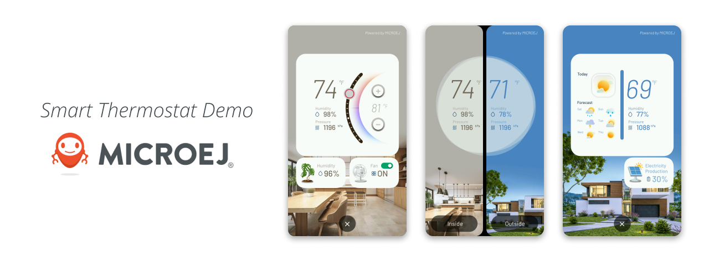
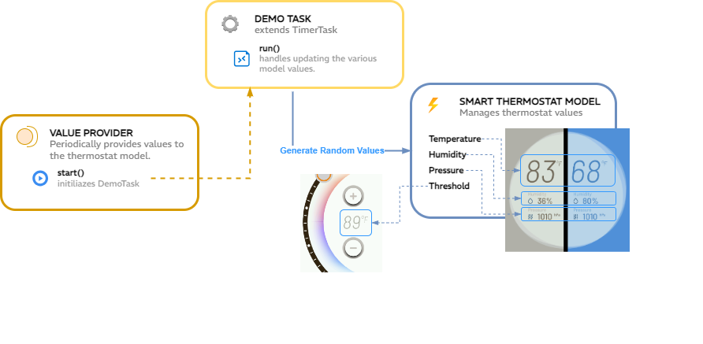

# Overview

This repository contains a Smart Thermostat demo application.



The application uses [MicroUI](https://docs.microej.com/en/latest/ApplicationDeveloperGuide/UI/MicroUI/index.html)
and [MicroVG](https://docs.microej.com/en/latest/ApplicationDeveloperGuide/UI/MicroVG/index.html) to
exploit hardware's vector capabilities and to make a nice-looking/efficient user interface.

The following things are explained in this document:

- How to run the application both on SIM and EMB.
- Navigating through the app
- How to add more widgets
- Using Buffered Images for performance optimization
- State Machine
- Mock Implementation with Observer Pattern (UML diagram)
- How to add Fade In Effect to future widgets

# Requirements

* MICROEJ SDK 6.
* A VEE Port that contains:
    * EDC-1.3 or higher.
    * BON-1.4 or higher.
    * MICROUI-3.4 or higher.
    * DRAWING-1.0 or higher.
    * MICROVG-1.4 or higher.

This example has been tested on:

* Android Studio with MicroEJ plugin for Android Studio 0.5.0.
* [NXP I.MXRT1170 VEE Port 2.0.0](https://github.com/MicroEJ/nxp-vee-imxrt1170-evk/tree/NXPVEE-MIMXRT1170-EVK-2.0.0).

# Project Structure

- `configuration`
    - `bsp_connection.properties`: configuration file containing bsp connection properties.
    - `common.properties`: configuration file containing main application options.
- `src/main/java/com/microej/demo/smart_thermostat`
    - `common`: package containing common classes used in the Smart Thermostat application.
    - `model`: package defining the model used to set / load values.
    - `style`: package containing styles and assets used across the UI.
    - `widget`: package containing all the widgets used by the application pages.
    - `Main.java`: Main class of the application.
    - `NavigationDesktop.java`: desktop for the thermostat application.
    - `PageSwitch`: file responsible for the handling of the pages widget state for home, inside and outside.
    - `UI`: file defining the entry point of the UI.
- `src/main/resources/`
    - `com.microej.demo.smart_thermostat`: package with the set of `.list` files for all the resources of the application.
    - `fonts`: package containing the font source files.
    - `images`: package containing the images source files.
    - `vector-images`: package containing the vector images source files.
- `build.gradle.kts`: Gradle configuration file.

# Features

The app consists of three unique pages: HOME, INSIDE PAGE (left) and OUTSIDE PAGE (right).

Here is the list of features implemented in each one:

``` bash
├── HOME                  # This page displays a divided screen between inside and outside thermostat information.
|                               # Information about both inside and outside is displayed on label widgets.
|                                     #   Temperature values in Farenheit Degrees.
|                                     #   Humidity values in percent.  
|                                     #   Pressure values in pdha.  
|                               # A pop up is triggered any time the threshold is being updated on top-left corner.
|                               # Navigate to the "INSIDE PAGE" by clicking on the "Inside" button.
|                               # Navigate to the "OUTSIDE PAGE" by clicking on the "Outside" button.
├── INSIDE PAGE           # This page displays the information about the "Inside" space thermostat values.
|                               # Information about the inside space is displayed on label widgets.
|                               # Update temperature threshold by dragging on the slider widget.
|                               # Update temperature threshold by clicking on "+" or "-" buttons. 
|                               # Turn ON or OFF the indoor Fan. 
|                               # Visualize current Humidity percentage with plant animated vector icon.
├── OUTSIDE PAGE          # This page displays the information about the "Outside" space thermostat values.
|                               # Information about the outside space is displayed on label widgets.
|                               # Visualize weather forecast with weather widgets. 
|                               # Visualize electricity production with solar panel animated vector icon.
```

# Usage

The main class is [Main.java](src/main/java/com/microej/demo/smart_thermostat/Main.java).

## Run on Simulator

In Android Studio:

- Open the Gradle tool window by clicking on the elephant icon on the right side,
- Expand the `Tasks` list,
- From the `Tasks` list, expand the `microej` list,
- Double-click on `runOnSimulator`,
- The application starts, the traces are visible in the Run view.

Alternative ways to run in simulation are described in
the [Run on Simulator](https://docs.microej.com/en/feature-microej-sdk-6/SDK6UserGuide/runOnSimulator.html)
documentation.

## Run on Device

Make sure to properly set up the VEE Port environment before going further.
Refer to the VEE Port README for more information:

- [NXP I.MXRT1170 VEE Port 2.0.0](https://github.com/MicroEJ/nxp-vee-imxrt1170-evk/tree/NXPVEE-MIMXRT1170-EVK-2.0.0)

In Android Studio:

- Open the Gradle tool window by clicking on the elephant on the right side,
- Expand the `Tasks` list,
- From the `Tasks` list, expand the `microej` list,
- Double-Click on `runOnDevice`.
- The device is flashed. Use the appropriate tool to retrieve the execution traces.

Alternative ways to run on device are described in
the [Run on Device](https://docs.microej.com/en/feature-microej-sdk-6/SDK6UserGuide/runOnDevice.html) documentation.

## App Navigation

The app's navigation is handled by an animated vector graphics file named `overlay.xml`.
It utilizes **elapsed time** as a reference to traverse various states/pages.


To understand the workflow for working with this component, follow this simplified process of how the animation is
created from the source code:

1. The `renderContent()` method in the Overlay widget generates the `overlay.xml` vector graphics image.
2. Use `VectorGraphicsPainter.drawAnimatedImage` to adjust the animation timeline by updating the ``elapsedTime`` value.
3. Based on the `elapsedTime`, the overlay animation can be in one of four states: HOME, INSIDE PAGE, OUTSIDE PAGE, or
   IN
   TRANSITION.
4. Transition between states using the `animateOverlay(src, dst)` function.
5. The `Easy-In` and `Easy-Out` motion effect is achieved through the use of the `MotionAnimation` library.

Refer to the original After Effects timeline image for the `overlay.xml` animation:


## Adding more Widgets

When adding widgets based on the `overlay.xml` reference, multiple layers can be positioned either behind it (home) or
above it (inside/outside labels). Follow these steps to add more widgets:

1. Open the `PageSwitch.java` class.
2. Within the chosen page method (`toHome`, `toInside`, `toOutside`, or `setTransitionWidgets`), observe the positioning
   of existing widgets on the multi-layer canvas.
3. Add the new widget to the canvas using `addChild(widget, position, size)`.

This is a visual representing how multiple layers of widgets are being placed on the HOME page:


## Using BufferedImages for Performance Optimization

Buffered Images are used throughout the application to enhance screen rendering performance. Due to the overlapping
and render policy, rendering an animated widget triggers the rendering of overlapped components, often involving static
screen areas. The use of buffered images mitigates the need to render static parts of the screen frequently. For
detailed information, refer
to: [MicroEJ UI BufferedImage Documentation](https://docs.microej.com/en/latest/VEEPortingGuide/uiBufferedImage.html)

The following components/widgets utilize buffered images for improved performance:

1. **`BubbleLabels`**: Buffered images are generated after updating information from mock values. The buffered image is
   displayed until a new update is received, at which point the actual content of the vector fonts is redrawn.
2. **`CircularSlider Threshold Value`**: Similar to labels, a buffered image is rendered after the threshold is updated,
   whether from mock values, slider cursor movements, or buttons.
3. **`DateWidget`**: The top-right static label "Powered By MicroEJ" lacks animation. However, due to overlay and
   bubbleWidget animations, rendering a buffered image consistently optimizes this screen area.
4. **`Secondary Info Bubbles`**: When the slider widget is touched and dragged, animated vector icons on secondary info
   bubbles use buffered images to "freeze" the animation, enhancing slider performance.
5. **`WeatherWidget`**: After the fade-in is complete, the entire weather widget is captured as a buffered image for
   optimized rendering.


## Managing Application States

While navigating through the demo, the application must be aware of the state it is in: being in a transition between two
pages or being on a certain page. It will show images and animations accordingly. 
The state management is done in the singleton class `Context.java`.

The currently existing states are:

1. **`HOME`**: The application is showing the page HOME. If the user clicks on a
   button, the state will change to the transition state `TRANSITION_INSIDE` or `TRANSITION_OUTSIDE`.
2. **`INSIDE`**: The application is showing the page INSIDE. If the user clicks on the 'X'
   button, the state will change to the state `TRANSITION_HOME`.
3. **`OUTSIDE`**: The application is showing the page OUTSIDE. If the user clicks on the 'X'
   button, the state will change to the state `TRANSITION_HOME`.
4. **`TRANSITION_INSIDE`**: The application is showing a transition animation. When the animation is done, the
   state `INSIDE` will be reached.
5. **`TRANSITION_OUTSIDE`**: The application is showing a transition animation. When the animation is done, the
   state `OUTSIDE` will be reached.
6. **`TRANSITION_HOME`**: The application is showing a transition animation. When the animation is done, the
   state `HOME` will be reached.

## Random Value Provider

In this version, a `ValueProvider` module has been introduced to dynamically generate random values for the
`SmartThermostatModel`. The generated values are refreshed at a constant rate, reflecting real-time
updates across the user interface (UI).

The following schematic provides a simplified overview of the mechanism employed to generate those values:



## Low Resolution Switch

This demo has been designed to support 2 screen resolutions:
- 1280x720 (LDPI) - default configuration
- 1920x1080 (HDPI)

To switch between the LDPI and HDPI configuration consider the following points:

1. **LOW_RESOLUTION boolean configuration**: Ensure the appropriate value is set for the current VEE Port dimensions.
   This can be adjusted by navigating to `smartThermostat.constants.list` and modifying
   the `HIGH_RESOLUTION_SWITCH=false` boolean. The default value is configured for LDPI.
2. **Enable hdpi / ldpi resources**: Remove the `.tmp` file extension from the chosen version. For example,
   change `smartThermostat_hdpi.images.list.tmp` to `smartThermostat_hdpi.images.list`.
3. **Utilize `scale(int value)` for responsive values**: Prior to incorporating additional widgets, check
   the `LOW_RESOLUTION` boolean and `SCALE` factor for each new value. Navigate to the `scale(int value)` method
   in `NavigationDesktop` for more information.

## Adding a Fade In Effect

To implementi a **fade-in** effect to a new widget, follow these instructions:

1. **Extend the new widget to `FadeInWidget`**: Ensure that your new widget class inherits from the `FadeInWidget`
   class.
2. **Call super class**: Make sure to include ``super.onShown()`` in the ``onShown()`` method and ``super.onHidden()`` in the
   ``onHidden()`` method of your widget class.
3. **Get the dynamic alpha value**: When rendering or painting your widget, use the ``getAlpha()`` method to obtain the
   current alpha value for the fade-in effect. For example: `Painter.drawImage(g, image, x, y, getAlpha());`.

# Requirements

N/A.

# Dependencies

_All dependencies are retrieved transitively by Gradle_.

# Source

N/A.

# Restrictions

None.

---  
_Markdown_   
_Copyright 2023-2024 MicroEJ Corp. All rights reserved._   
_Use of this source code is governed by a BSD-style license that can be found with this software._ 